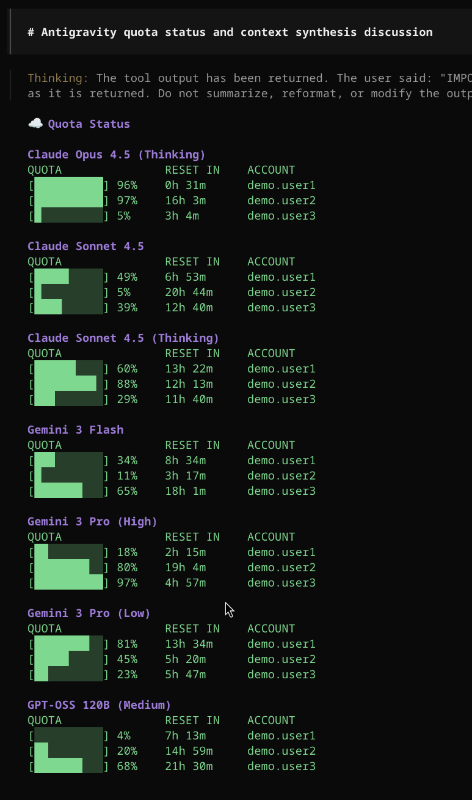
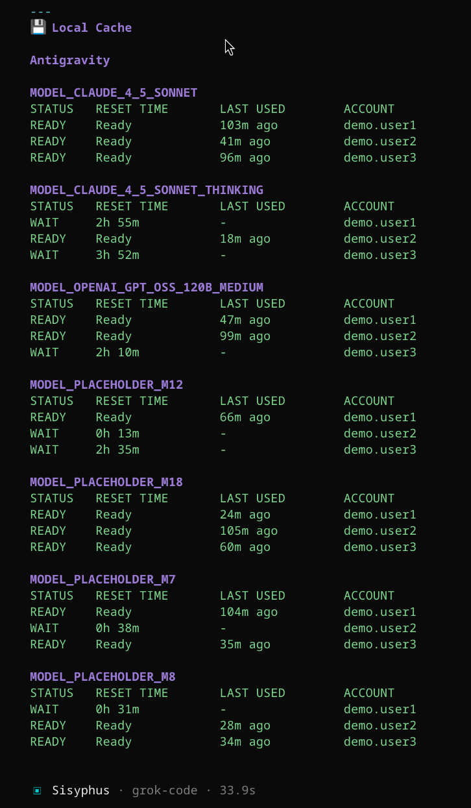

# OpenCode Antigravity Quota

OpenCode plugin to monitor Antigravity API/Gemini Cli quotas across multiple accounts.

<p align="center">
  
  
</p>

## Features

- **Multi-Account Monitoring**: Check API quotas for all your configured with opencode-antigravity-auth in one go.
- **Visual Quota Status**: clear, visual progress bars showing remaining quota for models like Gemini 3 Pro, Flash, and Claude.
- **Smart Grouping**: Automatically groups identical quota statuses to reduce clutter.
- **Reset Time Estimates**: detailed information on when your quotas will reset.
- **Local Cache Inspection**: View the status of your local rate limit cache to understand client-side throttling.

## Requirements

- **OpenCode AI**: This plugin is designed to run within the OpenCode environment.
- **Antrigravity Authentication Plugin**: This plugin requires the [opencode-antigravity-auth](https://github.com/NoeFabris/opencode-antigravity-auth) plugin to be installed and configured.
- **Account Credentials**: This plugin depends on the `antigravity-accounts.json` file, which is automatically generated by the `opencode-antigravity-auth` plugin.

## Installation

Add the plugin to your `opencode.json`, along with the `opencode-antigravity-auth` plugin:

```json
"plugin": [
    "opencode-antigravity-auth@1.2.8",
    "opencode-antigravity-quota@0.1.3"
],
```

Note that token management and authentication are handled by the `opencode-antigravity-auth` plugin.

## Usage

Call the `/antigravity-quota` tool or ask your LLM to show the Antigravity quota.

**Example Output:**

```markdown
# ☁️ Quota Status

### Gemini 1.5 Pro / Gemini 2.0 Flash
QUOTA               RESET IN    ACCOUNT
[██████████] 100%   23h 59m     user1
[█████░░░░░] 50%    12h 30m     user2

---
## 💾 Local Cache

### Antigravity
#### gemini-antigravity:gemini-1.5-pro
STATUS   RESET TIME       LAST USED        ACCOUNT
READY    Ready            5m ago           user1
WAIT     15m              -                user2
```


## Development

- **Run locally**: `bun run src/index.ts` (Note: This might fail if not running inside the OpenCode context).
- **Lint/Format**: Use your preferred tools.

## License

[MIT](LICENSE)
